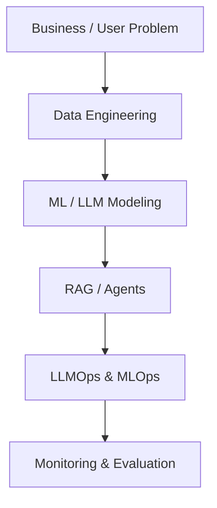
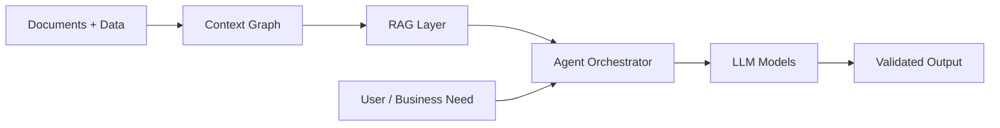

<!-- ================= HERO ================= -->
<div align="center">

<p>
  <a href="https://www.linkedin.com/in/saidhruvyellanki/">
    
  </a>
  <a href="mailto:dhruvsai@umd.edu">
    
  </a>
  <a href="https://github.com/dhruvyellanki19">
    
  </a>
</p>

</div>

---

<!-- ================= CURRENT WORK ================= -->
## 🧠 What I’m Working On Right Now
<div align="center">

```mermaid
flowchart LR
    A[Raw Data & Documents] --> B[Context Graph Construction]
    B --> C[Entity & Memory Linking]
    C --> D[RAG Retrieval]
    D --> E[Recursive Reasoning LLM]
    E --> F[Multi-Agent Validation]
    F --> G[Grounded Final Output]
````

</div>

> **Focus:** Context Graph–based RAG, Recursive Reasoning LMs, and Multi-Agent Orchestration
> **Goal:** Reduce hallucinations, improve reasoning depth, enable real-world automation

---

<!-- ================= EXPERIENCE TIMELINE ================= -->

## 🚀 My Journey (Visual)

<div align="center">

```mermaid
timeline
    title Professional Journey
    2022 : DHL Global Forwarding<br/>Operations Analytics
    2023 : Ramphal Technologies<br/>Data Science & Systems
    2024 : Watzmann Consulting<br/>Predictive ML & MLOps
    2025 : Aurelius Tech & Talent Solutions<br/>LLM Systems & RAG
```

</div>

---

<!-- ================= WHAT I BUILT ================= -->

## 🛠️ What I’ve Built (How I Think)

<div align="center">



</div>

---

<!-- ================= SKILLS VISUAL ================= -->

## ⚙️ Skills & Frameworks (Visual Stack)

### 🧑‍💻 Programming & Data

<p align="center">
  
</p>

### 🧠 Machine Learning & Deep Learning

<p align="center">
  
  <br/>
  
  
</p>

### 🤖 LLMs, RAG & Agents

<p align="center">
  
  
  <br/>
  
  
</p>

### ⚙️ MLOps, Backend & Infra

<p align="center">
  
</p>

### ☁️ Cloud, Data & Monitoring

<p align="center">
  
  <br/>
  
  
  
</p>

---

<!-- ================= PROJECT SYSTEM VIEW ================= -->

## 🧩 Example System I Build

<div align="center">



</div>

---

<!-- ================= STATS ================= -->

## 📊 GitHub Activity

<div align="center">
  
  
</div>

---

<!-- ================= CTA ================= -->

## 🤝 Let’s Build

I’m interested in **AI Engineer / ML Engineer / Applied Scientist** roles focused on:

**LLMs · RAG · Context Graphs · Agentic AI · MLOps**

📍 LinkedIn: [https://www.linkedin.com/in/saidhruvyellanki/](https://www.linkedin.com/in/saidhruvyellanki/)
📧 Email: [dhruvsai@umd.edu](mailto:dhruvsai@umd.edu)


